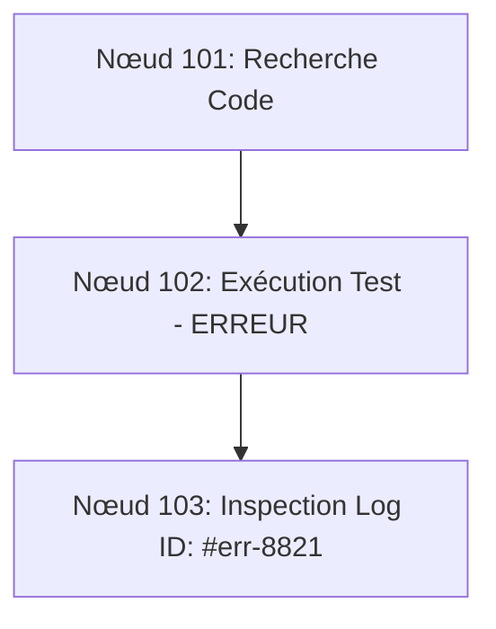

# L'Architecture de la Mémoire Agentique : Décryptage de Tencent DB et de la Révolution de la Sobriété Contextuelle

Pour tout ingénieur produit IA, le constat sur les agents autonomes en production est le même : au-delà d'un certain nombre d'interactions, les performances s'effondrent et les coûts explosent. L'approche naïve consistant à réinjecter l'intégralité de l'historique dans la fenêtre de contexte montre rapidement ses limites.

Récemment, l'équipe base de données de Tencent Cloud a publié un projet open source sous licence MIT qui remet en cause le dogme des « contextes infinis ». En obtenant plus de 10 400 étoiles sur GitHub en 117 jours, Tencent DB propose un changement de paradigme : **aider l'agent à se souvenir de moins de choses, mais de manière structurée**.

---

## 1. Vulgarisation : Le Paradoxe de la Mémoire IA

### Le problème du "Context Hoarding" (L'accumulation compulsive)

Un agent IA classique fonctionne sans mémoire persistante native entre ses exécutions. Pour lui donner l'illusion de la continuité, la boucle d'orchestration lui réinjecte systématiquement tout l'historique : conversations, logs d'exécutions, sorties d'outils, erreurs et fichiers lus.

Lors d'une exécution de 40 tours sur une tâche complexe, l'agent réingère sans cesse les mêmes données. Il en résulte une consommation aberrante de jetons (parfois plusieurs milliards de tokens sur un benchmark global) et des répétitions absurdes.

```
[Agent classique]
Historique brut réinjecté -> Prompts géants -> Coûts astronomiques + Dégradation des facultés

```

> **Le piège de la grande fenêtre de contexte :**
> Une étude menée en 2025 par l'équipe de Chroma sur 18 modèles de pointe (dont GPT-4.1, Claude 4, Gemini 2.5 et Qwen 3) a démontré qu'à mesure que le contexte s'élargit, la précision baisse. Une fenêtre théorique de 200 000 tokens commence à se dégrader dès 50 000 tokens, perdant parfois 30 % à 50 % de précision sur des tâches de recherche simples.
> 
> 

### La solution : Oublier pour mieux raisonner

Tencent DB démontre que la clé de la sobriété n'est pas le résumé destructif, mais la **compression structurée**. En éliminant le bruit et en ne conservant que l'empreinte topologique de la tâche, le taux de succès des agents augmente tout en réduisant drastiquement le volume de tokens consommés.

---

## 2. Déroulé Chronologique et Architecture Technique

```
Évolution de l'architecture mémoire :
[2025] L'ère du Prompt Padding (Accumulation brute)
  └── [Avril 2026] Tencent DB V1 : Task Canvas (Mermaid) + Consolidation à 4 niveaux (L0-L3)
        └── [Juillet 2026] Tencent DB V2 : La mémoire comme actif d'équipe (Skills, Wiki, Code Graph)

```

### Étape 1 : Le "Task Canvas" ou la compression graphique à court terme (Avril 2026)

Dans les tâches de longue durée, les principaux consommateurs de tokens ne sont pas les instructions de l'utilisateur, mais les logs intermédiaires, les traces d'erreurs et les dumps de fichiers.

Tencent DB applique la stratégie suivante:

* 
**Offloading des logs bruts** : La totalité des sorties d'outils est stockée dans des fichiers Markdown isolés sur le disque local.


* 
**Graphe Mermaid contextuel** : Dans le prompt de l'agent, les centaines de milliers de tokens de logs sont remplacés par un diagramme Mermaid léger décrivant les actions et la structure sous forme de nœuds dotés d'identifiants.


* 
**Navigation à la demande** : Si l'agent rencontre une erreur et a besoin de détails, il effectue un `grep` sur l'identifiant du nœud pour extraire le texte brut d'origine.




Pour gérer la taille du canevas, Tencent DB utilise deux seuils dynamiques:

* À **50 %** de remplissage de la fenêtre de contexte, une compression légère est appliquée.


* À **85 %**, une compression agressive intervient.


* Le "Canvas" lui-même ne peut dépasser **20 %** du budget total de tokens pour ne jamais encombrer le contexte utile.


### Étape 2 : La consolidation à long terme en 4 couches (Inspiration psychologique)

Tencent s'est inspiré des travaux d'Endel Tulving (1972) sur la mémoire épisodique et sémantique, ainsi que de la courbe de l'oubli d'Ebbinghaus (1885). Le système de long terme s'articule autour de 4 niveaux d'abstraction:

* 
**L0 (Mémoire épisodique brute)** : L'historique exact des conversations.


* 
**L1 (Atomes de connaissance)** : Extraction de faits clés, de préférences et de contraintes (exécutée par défaut tous les 5 tours).


* 
**L2 (Scènes)** : Regroupement des atomes par projet, type de tâche ou situation récurrente.


* 
**L3 (Persona)** : Reconstruction globale des habitudes et conventions de l'utilisateur (mise à jour toutes les 50 nouvelles mémoires).


L'agent lit les données de haut en bas : il consulte le **L3** en priorité (économie de tokens), ne descend au **L1** que pour un fait spécifique, et n'accède au **L0** qu'en cas de besoin textuel exact.

### Étape 3 : L'évolution V2 – La mémoire comme actif partagé (Juillet 2026)

En juillet 2026, Tencent DB a fait évoluer la mémoire d'un statut de cache privé à celui d'**actif d'équipe partagé** articulé autour de 4 composants:

* 
**Chat Memory** : Contexte transactionnel.


* 
**Skills (Compétences)** : Modèles d'exécution versionnés contenant règles de validation, déclencheurs et fichiers de ressources.


* 
**Wiki d'Agent** : Pages Markdown interconnectées que l'agent rédige et entretient de façon autonome (concept formalisé par Andrej Karpathy).


* 
**Code Graph** : Indexation de la structure du codebase permettant à l'agent de démarrer une tâche en connaissant déjà les dépendances.


* 
**Cold Start (Démarrage à froid)** : Remplissage initial du graphe, du wiki et des compétences à partir d'un dépôt existant ou d'historiques d'agents.


---

## 3. Analyse Critique pour l'Ingénieur Produit

Bien que les performances annoncées soient remarquables, une analyse rigoureuse impose de souligner plusieurs zones d'ombre techniques et industrielles.

### 1. Des benchmarks prometteurs mais non reproduits

Les chiffres annoncés par Tencent montrent des gains majeurs, mais nécessitent une confirmation indépendante:

* Sur le benchmark **Wide Search** de ByteDance, le taux de succès passe de **33 % à 50 %** (+51 % de gain relatif) avec une réduction de **61 %** des tokens.


* Sur **SWE-bench**, le score passe de **58,4 % à 64,2 %** avec un tiers de tokens en moins.


* Sur **PersonaMem**, la précision de suivi des préférences utilisateur passe de **48 % à 76 %**.


> **Avertissement :**
> Aucun laboratoire indépendant n'a encore publié de reproduction de ces résultats. De plus, des petites incohérences d'arithmétique apparaissent dans la documentation commerciale sur SWE-bench (une réduction de tokens annoncée à 33,1 % alors que la division brute donne 31,6 %).
> 
> 

### 2. Le problème de l'invalidation du Prompt Caching (Issue #120)

C'est le point de vigilance majeur pour la gestion des coûts en production :

* Les fournisseurs de modèles (OpenAI, Anthropic, Google) proposent des remises importantes sur le **Prompt Caching** lorsque les premiers tokens d'un prompt restent identiques entre deux appels.


* En modifiant dynamiquement l'en-tête du prompt à chaque tour pour y injecter les blocs Persona et Scènes mis à jour, Tencent DB invalide le cache du provider.


* Résultat : Bien que le nombre total de tokens diminue, **le prix unitaire par token peut augmenter**, annulant une partie des gains financiers. Un chantier est ouvert pour stabiliser le préfixe de prompt.


### 3. Dette technique, sécurité et concurrence interne

* 
**Injections de requêtes** : L'issue la plus débattue (#180) concerne un défaut d'échappement dans les requêtes de recherche, permettant à une entrée utilisateur non assainie de réécrire la requête interne.


* 
**Concurrence interne chez Tencent** : Preuve que la couche mémoire n'est pas encore stabilisée, une autre équipe au sein de Tencent a publié quelques semaines plus tard un plugin rival pour le même framework (OpenClaw), proposant une architecture à 6 couches et un système bimodal fast/slow.


* 
**Stratégie Open-Core** : L'image Docker par défaut utilise l'endpoint Tencent Cloud et le modèle DeepSeek v3, orientant subtilement les utilisateurs vers leurs services managés.


---

## 4. Synthèse : Problématiques vs Solutions Proposées

| Problématique Produit / IA | Cause Racine | Solution Apportée par Tencent DB |
| --- | --- | --- |
| <br>**Baisse de précision sur longs contextes** 

 | Distraction du modèle par accumulation de logs inutiles dans le prompt.

 | <br>**Task Canvas (Mermaid)** : Remplacement des logs par un graphe compact et stockage brut sur disque.

 |
| <br>**Coûts d'inférence explosifs** 

 | Réinjection de l'historique complet à chaque tour de boucle.

 | <br>**Consolidation L0-L3** : Lecture descendante hiérarchisée des faits et préférences.

 |
| <br>**Amnésie lors des changements de session** 

 | Absences d'actifs de mémoire partagés et structurés.

 | <br>**Mémoire V2** : Wiki partagé, graphes de code et paquets de compétences versionnés.

 |
| <br>**Dépendance aux infrastructures cloud** 

 | Solution propriétaires de mémoire vectorielle sur API payantes.

 | <br>**Architecture 100% Locale** : Moteur SQLite avec extension `sqlite-vec` et recherche hybride BM25 + RRF.

 |

---

## 5. Sources & Références

Les informations et analyses de cet article sont issues des données de la transcription suivante :

* 
**Chroma Research (2025)** : Étude d'évaluation sur 18 modèles de pointe concernant la dégradation de la précision en fonction de la taille du contexte.


* **Dépôt Tencent DB / OpenClaw Plugin (2026)** :
* Documentation d'architecture (Task Canvas, Mermaid Graphs, seuils 50%/85%/20%).


* Implémentation du modèle de mémoire hiérarchique L0-L3 inspiré d'Endel Tulving (1972) et d'Hermann Ebbinghaus (1885).


* Benchmark résultats sur *Wide Search* (ByteDance Seed Team), *SWE-bench*, *PersonaMem*, et *Artificial Analysis*.


* Feuille de route V2 : Skills, Wiki (Andrej Karpathy), Code Graph et gestion des accès.


* Détails techniques d'infrastructure : SQLite + `sqlite-vec`, BM25, Reciprocal Rank Fusion (RRF), timeout 5s.


* **Discussion Communauté & GitHub Issues** :
* Issue #120 : Invalidation du Prompt Caching chez les API providers.


* Issue #180 : Faiblesse de sécurité sur l'échappement des opérateurs dans les requêtes de recherche.


* Rivalité interne avec l'autre plugin mémoire Tencent à 6 couches.