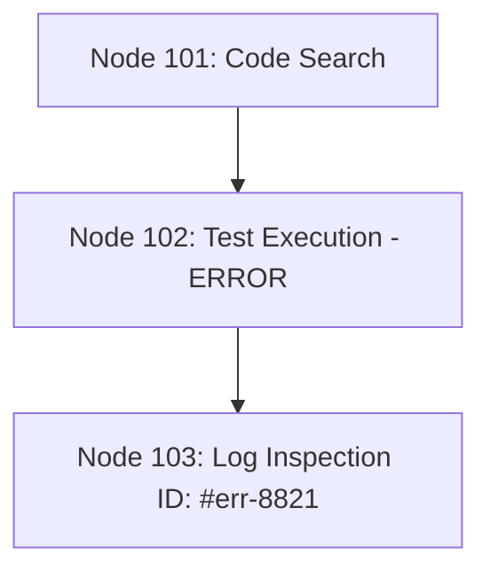

# Agentic Memory Architecture: Deciphering Tencent DB and the Revolution of Contextual Sobriety

For any AI product engineer, the observation regarding autonomous agents in production is identical: past a certain number of interactions, performance collapses and costs explode. The naive approach of reinjecting the entire history into the context window rapidly reveals its limits.

Recently, the database team at Tencent Cloud published an MIT-licensed open-source project that challenges the dogma of "infinite contexts." By securing over 10,400 GitHub stars in just 117 days, Tencent DB offers a paradigm shift: **helping the agent remember less, but in a structured manner.**

---

## 1. High-Level Overview: The AI Memory Paradox

### The Problem of "Context Hoarding"

A conventional AI agent operates without native persistent memory between executions. To create the illusion of continuity, the orchestration loop systematically reinjects the entire history: conversations, execution logs, tool outputs, errors, and read files.

During a 40-turn execution on a complex task, the agent continuously re-ingests the exact same data. This results in absurd token consumption (sometimes several billion tokens on a global benchmark) and useless repetitions.

```
[Traditional Agent]
Raw History Reinjected -> Massive Prompts -> Astronomical Costs + Degradation of Abilities

```

> **The Large Context Window Trap:**
> A study conducted by Chroma across 18 state-of-the-art models (including GPT-4.1, Claude 4, Gemini 2.5, and Qwen 3) demonstrated that as the context expands, accuracy drops. A theoretical window of 200,000 tokens begins to degrade around 50,000 tokens, losing 30% to 50% accuracy on basic retrieval tasks.

### The Solution: Forgetting to Reason Better

Tencent DB demonstrates that the key to context sobriety is not destructive summarization, but **structured compression**. By stripping away noise and preserving only the topological footprint of a task, agent success rates increase while dramatically reducing token consumption.

---

## 2. Chronological Timeline and Technical Architecture

```
Memory Architecture Evolution:
[2025] The Prompt Padding Era (Raw Accumulation)
  └── [April 2026] Tencent DB V1: Task Canvas (Mermaid) + 4-Level Consolidation (L0-L3)
        └── [July 2026] Tencent DB V2: Memory as a Team Asset (Skills, Wiki, Code Graph)

```

### Step 1: The "Task Canvas" or Short-Term Graphic Compression (April 2026)

In long-running tasks, the primary token consumers are not user instructions, but intermediate logs, error traces, and file dumps.

Tencent DB applies the following strategy:

* **Raw Log Offloading**: All tool outputs are stored in isolated Markdown files on local disk.
* **Contextual Mermaid Graph**: Inside the agent's prompt, hundreds of thousands of log tokens are replaced by a lightweight Mermaid diagram describing actions and structure as nodes with unique IDs.
* **On-Demand Navigation**: If the agent encounters an error and needs details, it performs a `grep` on the node ID to fetch the raw source text.



To manage canvas size, Tencent DB utilizes two dynamic thresholds:

* At **50%** context window fill, light compression is applied.
* At **85%**, aggressive compression triggers.
* The "Canvas" itself cannot exceed **20%** of the total token budget to avoid cluttering useful context.

### Step 2: 4-Layer Long-Term Consolidation (Psychological Inspiration)

Tencent drew inspiration from Endel Tulving's work (1972) on episodic vs. semantic memory, alongside Hermann Ebbinghaus's forgetting curve (1885). The long-term system relies on 4 abstraction levels:

* **L0 (Raw Episodic Memory)**: The exact history of interactions.
* **L1 (Knowledge Atoms)**: Extraction of key facts, preferences, and constraints (executed by default every 5 turns).
* **L2 (Scenes)**: Grouping of atoms by project, task type, or recurring situation.
* **L3 (Persona)**: Global reconstruction of user habits and conventions (updated every 50 new memory items).

The agent navigates data top-down: it consults **L3** first (saving tokens), drops down to **L1** only for a specific fact, and accesses **L0** only in cases where exact text matches are required.

### Step 3: V2 Evolution – Memory as a Shared Team Asset (July 2026)

Tencent DB expanded memory from a private cache into a **shared team asset** structured around 4 components:

* **Chat Memory**: Transactional context.
* **Skills**: Versioned execution templates containing validation rules, triggers, and resource files.
* **Agent Wiki**: Interlinked Markdown pages authored and maintained autonomously by the agent (a concept formalized by Andrej Karpathy).
* **Code Graph**: Codebase structure indexing that allows an agent to start a task with pre-existing knowledge of dependencies.
* **Cold Start**: Initial population of the graph, wiki, and skills from an existing repository or agent execution logs.

---

## 3. Critical Analysis for Product Engineers

While the reported performance gains are notable, a rigorous analysis requires highlighting several technical and operational trade-offs.

### 1. Promising Benchmarks Awaiting Third-Party Replication

Figures published by Tencent demonstrate major gains, but require independent verification:

* On ByteDance's **Wide Search** benchmark, the success rate increased from **33% to 50%** (+51% relative gain) with a **61%** reduction in tokens.
* On **SWE-bench**, the score rose from **58.4% to 64.2%** while consuming one-third fewer tokens.
* On **PersonaMem**, user preference tracking accuracy jumped from **48% to 76%**.

> **Caution:**
> No independent laboratory has published a third-party reproduction of these benchmark results yet. Additionally, minor arithmetic inconsistencies exist in the documentation regarding SWE-bench (a reported token reduction of 33.1% compared to 31.6% via direct calculation).

### 2. The Prompt Caching Invalidation Issue (Issue #120)

This represents a major cost management consideration for production deployments:

* Model providers (OpenAI, Anthropic, Google) offer steep discounts for **Prompt Caching** when the prefix tokens of a prompt remain identical across requests.
* By dynamically altering the prompt header on every turn to inject updated Persona and Scene blocks, Tencent DB invalidates provider cache hits.
* Result: While the overall token count decreases, **the unit price per token can increase**, neutralizing a portion of the financial savings. Active work is underway to stabilize the prompt prefix.

### 3. Technical Debt, Security, and Internal Rivalry

* **Prompt / Query Injection**: The most discussed issue (#180) involves missing search query escaping, allowing un-sanitized user input to rewrite internal retrieval queries.
* **Internal Rivalry at Tencent**: Demonstrating that the memory layer is still stabilizing, another team within Tencent released a competing plugin for the same framework (OpenClaw) just weeks later, featuring a 6-layer architecture and a fast/slow bimodal engine.
* **Open-Core Strategy**: The default Docker image defaults to Tencent Cloud endpoints and DeepSeek v3, subtly funneling users toward managed offerings.

---

## 4. Summary: Product Challenges vs. Proposed Solutions

| Product / AI Challenge | Root Cause | Tencent DB Solution |
| --- | --- | --- |
| **Accuracy Loss on Long Contexts** | Model distraction caused by accumulating raw logs in the prompt. | **Task Canvas (Mermaid)**: Replaces logs with a compact graph and offloads raw data to disk. |
| **Exploding Inference Costs** | Reinjecting complete history on every loop iteration. | **L0-L3 Consolidation**: Top-down hierarchical retrieval of facts and preferences. |
| **Session Amnesia** | Absence of structured, shared memory assets. | **V2 Shared Memory**: Shared wiki, code graphs, and versioned skill packs. |
| **Cloud Infrastructure Lock-in** | Proprietary vector memory solutions tied to paid APIs. | **100% Local Engine**: Embedded SQLite with `sqlite-vec` extension and hybrid BM25 + RRF search. |

---

## 5. Sources & References

The analyses presented in this article draw directly from technical disclosures and community telemetry:

* **Chroma Research**: Benchmark study on context length vs. precision degradation across 18 leading models.
* **Tencent DB / OpenClaw Plugin Repository**:
* Architectural specs (Task Canvas, Mermaid Graphs, 50%/85%/20% context thresholds).
* Implementation details for the L0-L3 memory hierarchy inspired by Endel Tulving (1972) and Hermann Ebbinghaus (1885).
* Benchmark results across *Wide Search* (ByteDance Seed Team), *SWE-bench*, *PersonaMem*, and *Artificial Analysis*.
* V2 Roadmap: Skills, Wiki (Andrej Karpathy concept), Code Graph, and access controls.
* Infrastructure stack: SQLite + `sqlite-vec`, BM25, Reciprocal Rank Fusion (RRF), 5-second retrieval timeout.


* **GitHub Community Discussions**:
* Issue #120: Provider Prompt Caching invalidation mechanics.
* Issue #180: Query operator escaping vulnerabilities in retrieval functions.
* Internal rivalry regarding Tencent's alternative 6-layer memory plugin.